# Mini Project - Integrating Helm with Jenkins


### Step 1: Integrating Helm with CI/CD (Jenkins)


1. Jenkins Setup: 

    - Install Jenkins on your system with the default recommended plugins. If Jenkins is not already installed, follow the [official jenkins installation guide](https://www.jenkins.io/doc/book/installing/)

Bellow are the process to install Jenkins in your window system, first click on the link above to take you to the official site, then select the window option. see the Image bellow

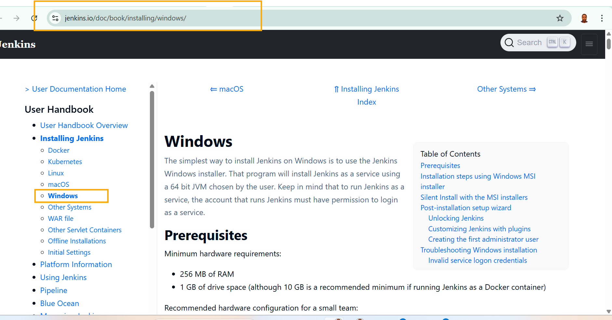


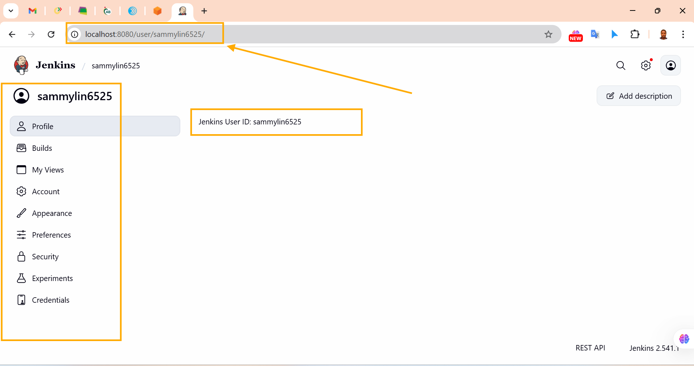


2.   Determine Helm Binary Path:

    - The full binary path of Helm is required in the Jenkins pipeline script.

        - To find it, use:

            - Linux/macOS: `which helm`

            - Window: Get-Command helm | Select-Object -`ExpandProperty Source` in PowerShell.

Run the command in PowerShell (Windows)

Step 1: Open PowerShell

  - Press Win + X
  - Click Windows PowerShell (or Terminal --> PowerShell)


Step 2: Run this Command (exactly)
    Copy-paste one line:

    ```
    Get-Command helm | Select-Object -ExpandProperty Source
    ```
    Then Press Enter.

    


- The output above is expected

     `C:\ProgramData\chocolatey\bin\helm.exe`,

    `C:\Program Files\helm\helm.exe`
                or
    `C:\Users\YourUser\AppData\Local\Programs\Helm\helm.exe`

 3. Create a Jenkins Pipeline:

    - In Jenkins, Create a new Pipeline job.

        - Set the Pipeline source as the Git repository you pushed your code to.

          - Configure the pipeline to trigger a build on commit to your repository.

Bellows are the steps:

Step 1: Create a New Jenkins Pipeline Job

   - Open Jenkins in your browser  
👉 http://localhost:8080 (or your Jenkins URL)

   - Click **New Item**
   - Enter or Ok.

   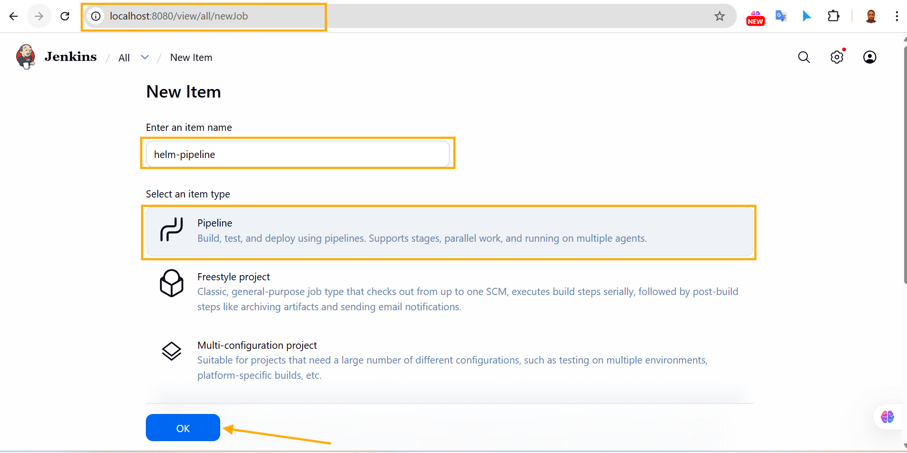

Step 2: Configure the Pipeline from Git
  - Scroll down to the **Pipeline** section.
    - Pipeline settings:
    - 👉 Pipeline script from SCM

- **SCM:**
    👉 Git

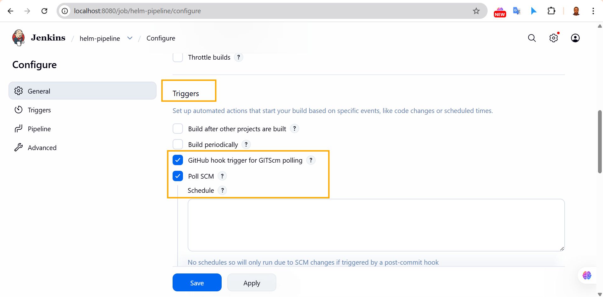

4. Pipeline Script Example with Full Helm Path:

    - Use the determined full path of Helm in the Pipeline script. For example:

```
        pipeline {"\n       agent any\n       stages {\n         stage('Deploy with Helm') {\n           steps {\n             script {\n               sh '/usr/local/bin/helm upgrade --install my-webapp ./webapp --namespace default'\n             "}
      }
    }
  }
}
```

- Bellow is a properly formatted script


```
pipeline {
    agent any

    stages {
        stage('Deploy with Helm') {
            steps {
                script {
                    sh '/usr/local/bin/helm upgrade --install my-webapp ./webapp --namespace default'
                }
            }
        }
    }
}
``` 


Remember If the Jenkins agent is Windows, use:


```
bat 'helm upgrade --install my-webapp ./webapp --namespace default'
```
  or with full path:

```
pipeline {
    agent any

    stages {
        stage('Deploy with Helm') {
            steps {
                script {
                    bat '"C:\ProgramData\chocolatey\bin\helm.exe" upgrade --install my-webapp ./webapp --namespace default'
                }
            }
        }
    }
}
```

```
pipeline {
    agent any

    environment {
        HELM = 'C:\\ProgramData\\chocolatey\\bin\\helm.exe'
    }

    stages {
        stage('Deploy with Helm') {
            steps {
                bat "\"%HELM%\" upgrade --install my-webapp ./webapp --namespace default"
            }
        }
    }
}
```

- Replace `/usr/local/bin/helm` with the path determined in Step 2.

The Image shows the Helm Pipeline Configured

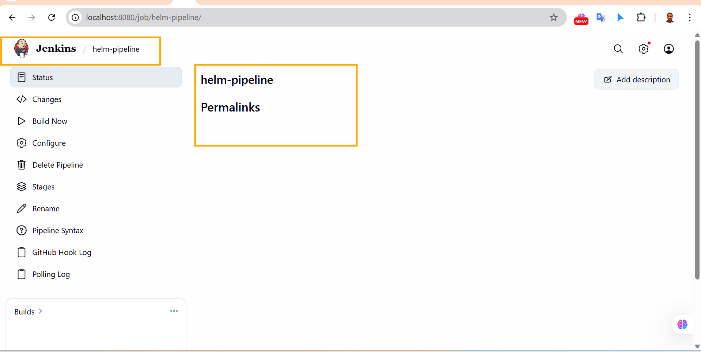


## Step 2: Update Helm Chart and Trigger Jenkins Pipeline.

1. Update Helm Chart and Push Changes:

    - Edit the `value.yaml` in your `webapp` chart directory.

    - Changes the `relicaCount` to `3` to increase the number of replicas.

    - Save the changes.

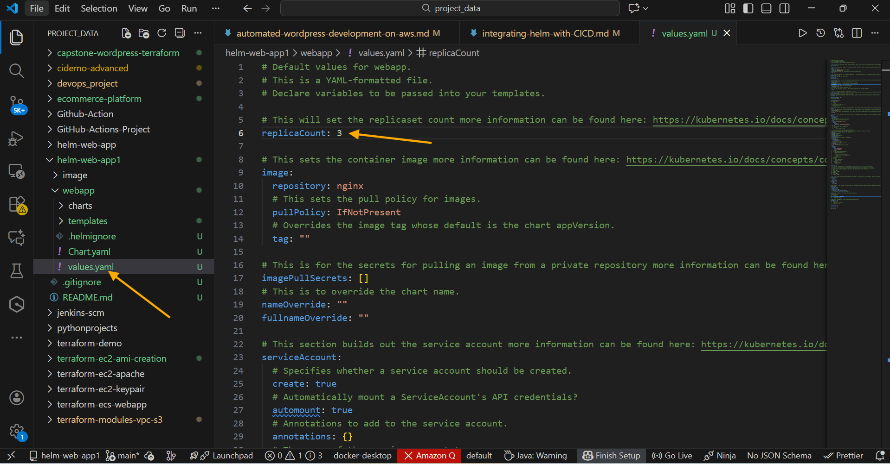


- Edit the  `templates/deployment.yaml` File:

    - Open `deployment.yaml` located in the `templates` directory.

    - Located the `resources` section under `spec.template.spec.containers`

    - Update the resource requested as follows:


```
resources:
  requests:
    memory: "180Mi"
    cpu: "120m"
```

  - Save the file after making your changes.

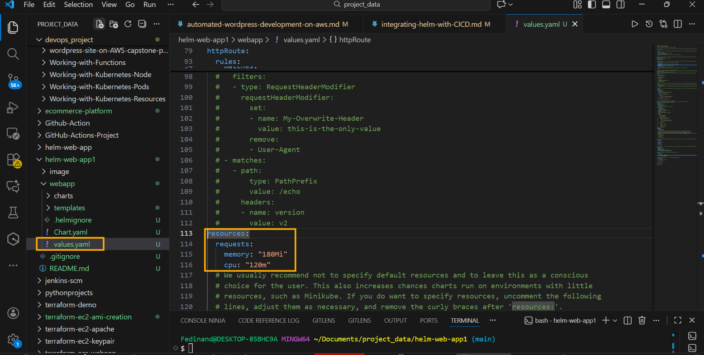

Bellow are the procedures to follow

First You have to create `helm-web-app1` directory then `cd` into the helm-web-app1

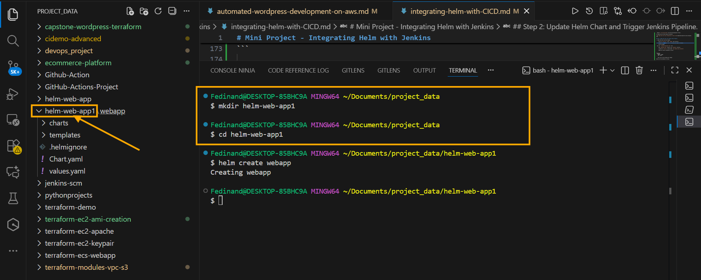

After creating `helm-web-app1` & `cd`  into the directory, then run this command bellow to create `webapp`.
`helm create webapp`
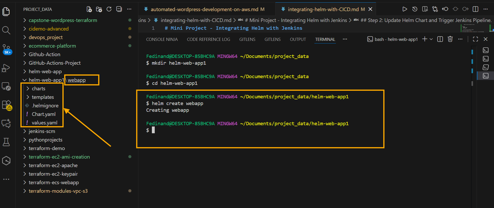


2. Commit and Push the Changes:

    - Use Git commands to commit these changes and push them to your remote repository. This will trigger the Jenkins Pipeline.

   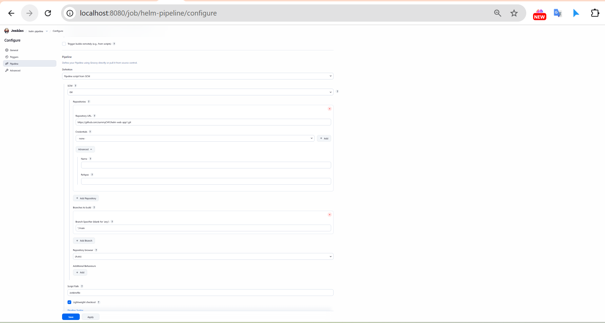

    - Execute the following commands in your terminal:

    ```
    git add .
    git commit -m "Updated replicas, memory and CPU requests"
    git push
    ```

3. Jenkins Pipeline Trigger:

    - Once you push the changes to the repository, the configured Jenkins Pipeline will detect the commit.

    - Jenkins will then automatically start a new build, deploying your updated Helm chart with the new configurations.  


### Jenkins Job Configuration (CRITICAL)

 A. Open Jenkins Job

 - Jenkins Dashboard
 - Click Your Pipeline job
 - Click Configure

B. Pipeline Section 

Set Exactly this:


Settings                        Value

Definition                      Pipeline script from SCM
SCM                             Git
Repository URL                  `https://github.com/sammyCHY/helm-web-app1.git`
Credentials                      (Set if Private repo)
Branches to build                `*/main`
Script Path                       Jenkinsfile

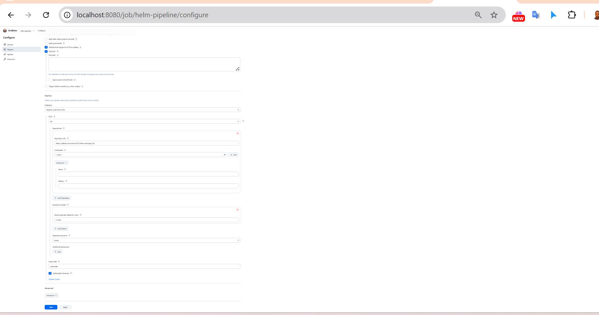

for growth.