# Mini Project - Integrating Helm with Jenkins


### Step 1: Integrating Helm with CI/CD (Jenkins)

### Prerequisites.
Before touching Jenkins, make sure your environment is ready:
   
   - kubectl installed and configured

   - Kubernetes Cluster (Minikube, Cloud Cluster or k3s lightweight, easiest on a single server)
   
   - Helm

   - Docker
   
   - Git


1. Jenkins Setup: 

    - Install Jenkins on your system with the default recommended plugins. If Jenkins is not already installed, follow the [official jenkins installation guide](https://www.jenkins.io/doc/book/installing/)


Bellow are the process to install Jenkins in your window system, first click on the link above to take you to the official site, then select the window option. see the Image bellow

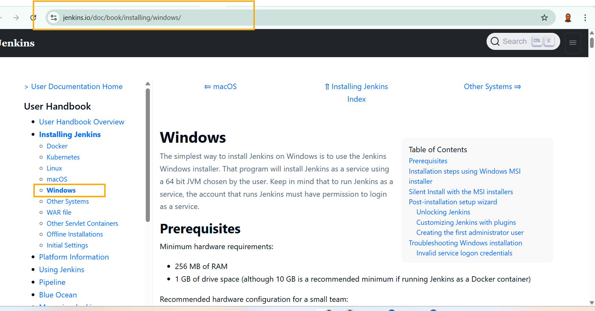


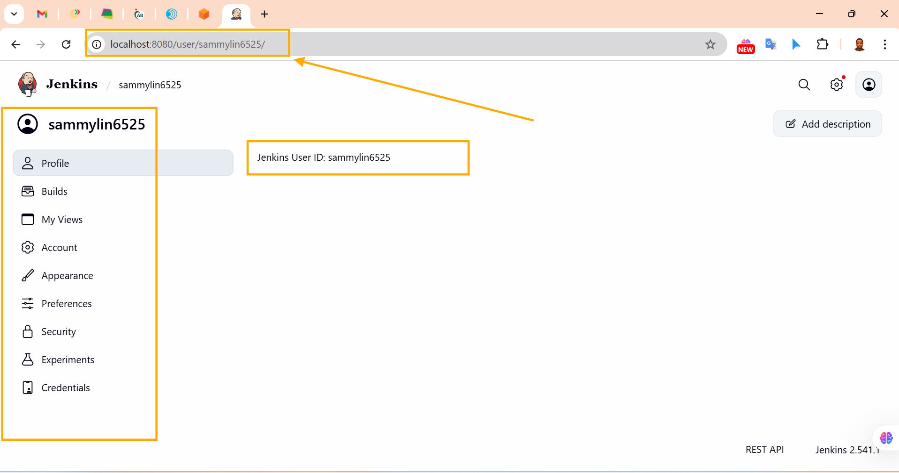


Here's a clear, real-world step-by-step guide to execute this mini project of integrating Jenkins with Helm and automating deployments.


2.   Determine Helm Binary Path:

    - The full binary path of Helm is required in the Jenkins pipeline script.

        - To find it, use:

            - Linux/macOS: `which helm`

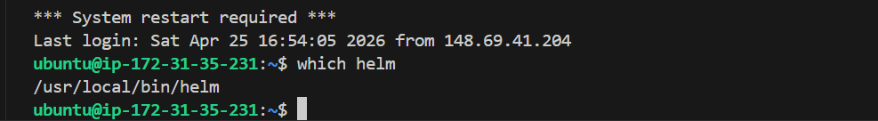

Helm need to be installed in the instance server by running this command below.

```
curl https://raw.githubusercontent.com/helm/helm/main/scripts/get-helm-3 | bash
```
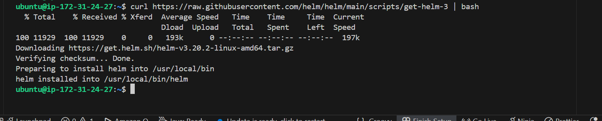


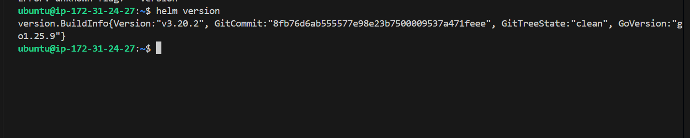


After the steps above, "kubectl" need to be installed for the helms to be able to run.

Install the kubectl by following the steps below:

    Step1: Download Kubectl using the command.
    
```
curl -LO "https://dl.k8s.io/release/$(curl -L -s https://dl.k8s.io/release/stable.txt)/bin/linux/amd64/kubectl"
```

Step 2: Make it executable using.

```
chmod +x kubectl
```

Step3: Move it to system path

```
sudo mv kubectl /usr/local/bin/
```

Step4: Verify installation.

```
kubectl version --client
```

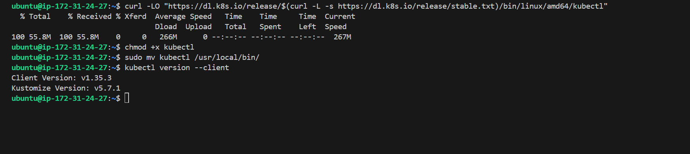


Installation on Linux.
Follow the steps below

Run the commands below:

```
sudo apt-get update
sudo apt-get install -y apt-transport-https ca-certificates curl gnupg
```

Add the Kubernetes signing key:

```
sudo mkdir -p /etc/apt/keyrings
curl -fsSL https://pkgs.k8s.io/core:/stable:/v1.35/deb/Release.key | sudo gpg --dearmor -o /etc/apt/keyrings/kubernetes-apt-keyring.gpg
```

Add the Kubernetes repository:

```
echo 'deb [signed-by=/etc/apt/keyrings/kubernetes-apt-keyring.gpg] https://pkgs.k8s.io/core:/stable:/v1.35/deb/ /' | sudo tee /etc/apt/sources.list.d/kubernetes.list
```
But if you are installing kubectl and have some challenges of certificate expiry, as a result of Ubuntu system not reaching the Kubernetes repo, but APT still does not trust it's TLS certificate chain. Then, the problem is no longer DNS or Connectivity. The issue is APT'S SSL trust path rejects 'pkgs.k8s.io' because of an expired intermediate certificate in the chain.

This happens on some Ubuntu images even after updating 'ca-certificates'.


Install Kubectl directly by running this command below

```
curl -LO "https://dl.k8s.io/release/$(curl -L -s https://dl.k8s.io/release/stable.txt)/bin/linux/amd64/kubectl"
```

Make it executable:

```
chmod +x kubectl
```
Then, move it into your PATH:

sudo mv kubectl /usr/local/bin/


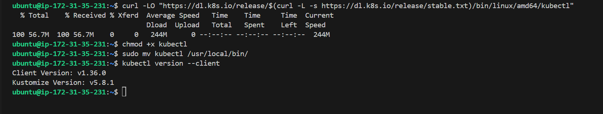

### Install K3s

```
curl -sfL https://get.k3s.io | sh -
```

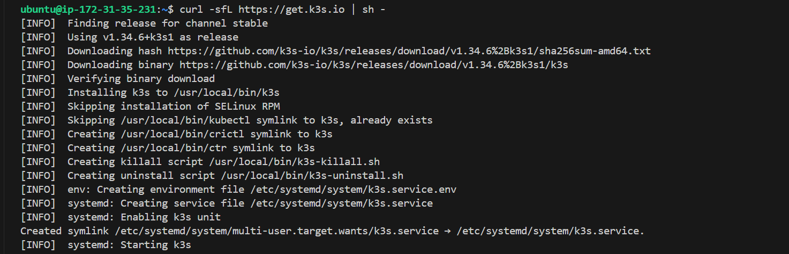

Check status:

```
sudo systemctl status k3s
```
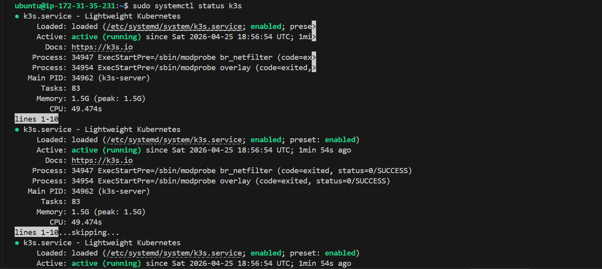

Check nodes:

```
sudo kubectl get nodes
```
After Installation of K3s cluster and you discovered this kind of error on the image below when you run `sudo kubectl get nodes`.
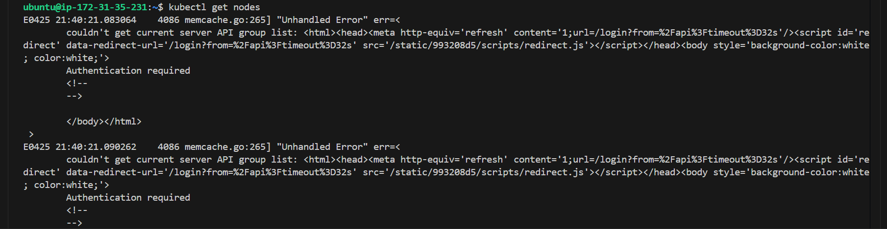

In this scenario, it means **Kubeconfig problem,** not Kubernetes failure, the `kubectl` is working, but it is talikng to the wrong server.

Instead of talking to my local k3s cluster, it is hitting a web login page(likely Jenkins, Rancher, or another dashboard), which is why Kubernetes return HTML instead of API JSON. Kubernetes should never return an HTML login page.

What it means, the current `kubectl` config (`~/.kube/config`) So kubectl is not querying my local K3s API.

    Then, steps to fix.

`sudo cat /etc/rancher/k3s/k3s.yaml` the command help to confirm the kubeconfig generated by `K3S`

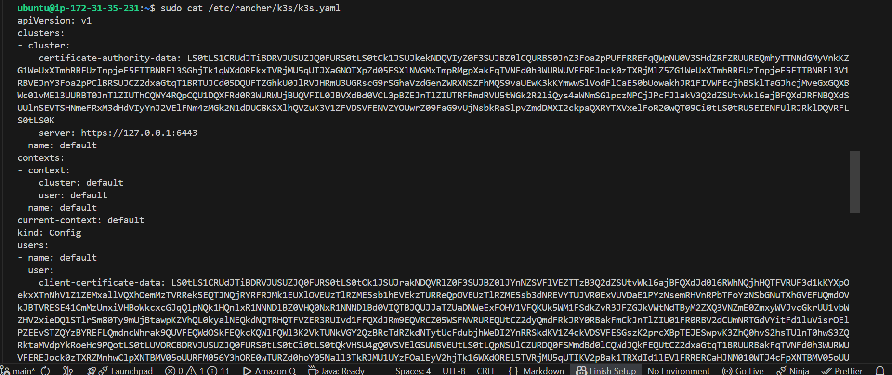

The time I run the command above, I discovered the K3S cluster config is correct and It has an IP of  server: `https://127.0.0.1:6443`. that means: 
- K3S API is local
- Jenkins is on the same machine.
- Jenkins can connect directly.
- no external Kubernetes credentials are needed.
So the task is simply to give jenkins access to this kubeconfig.

1. Create Jenkins Kubeconfig folder

    ```
    sudo mkdir -p /var/lib/jenkins/.kube
    ```

2. Copy the K3S kubeconfig

    ```
    sudo cp /etc/rancher/k3s/k3s.yaml /var/lib/jenkins/.kube/config
    ```
This gives Jenkins its own Kubernetes config.

3. Set Correct Permissions.

    ```
    sudo chown -R jenkins:jenkins /var/lib/jenkins/.kube
    sudo chmod 600 /var/lib/jenkins/.kube/config
    ```
Without this, Jenkins will fail with permission denied.

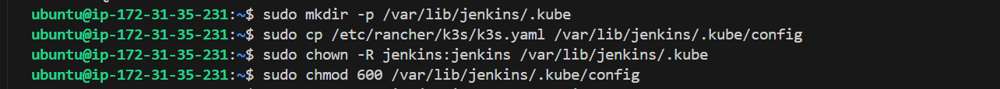

4. The this command `sudo cat /var/lib/jenkins/.kube/config` to confirm jenkins kubeconfig is correct and check if it still contains `server: https://127.0.0.1:6443`. That is correct API endpoint.

5. Make Jenkins use this Kubeconfig

Set environment variables for Jenkins:

```
sudo systemctl edit jenkins
```
then paste this two line below on the jenkins file

```
[Service]
Environment="KUBECONFIG=/var/lib/jenkins/.kube/config"
```
Save and Exit.

6. Reload Jenkins 

```
Sudo systemctl daemon-reload
sudo systemctl restart jenkins
```
This applies the Kubeconfig path


7. Test as Jenkins user
    switch to Jenkins:
`sudo su - jenkins`

Now test Kubernetes access:

```
kubectl get nodes
kubectl get pods -A
```

If this Works, Jenkins is fully connected to K3S.

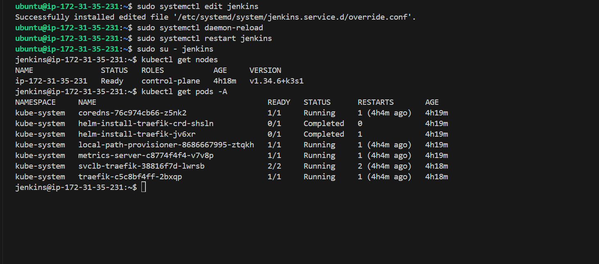


### Helm

 Install Helm

 ```
 curl https://raw.githubusercontent.com/helm/helm/main/scripts/get-helm-3 | bash
 ```

 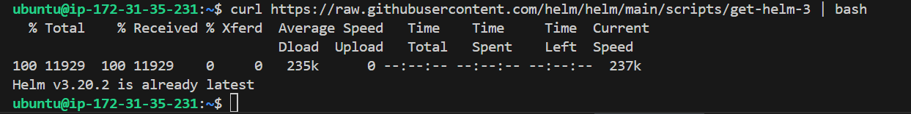


    - Window: Get-Command helm | Select-Object -`ExpandProperty Source` in PowerShell.

Run the command in PowerShell (Windows)

Step 1: Open PowerShell

  - Press Win + X
  - Click Windows PowerShell (or Terminal --> PowerShell)


Step 2: Run this Command (exactly)
    Copy-paste one line:

```
Get-Command helm | Select-Object -ExpandProperty Source
```
    
    
Then Press Enter.

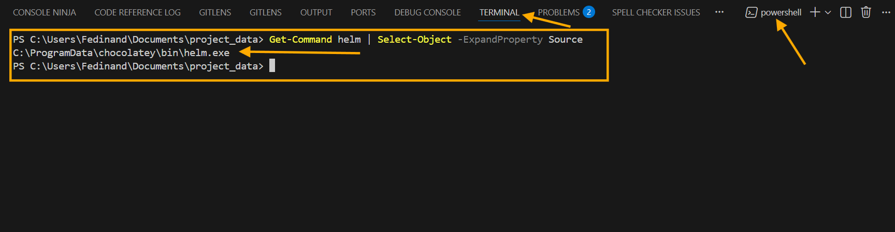


- The output above is expected

     `C:\ProgramData\chocolatey\bin\helm.exe`,

    `C:\Program Files\helm\helm.exe`
                or
    `C:\Users\YourUser\AppData\Local\Programs\Helm\helm.exe`

 3. Create a Jenkins Pipeline:

    - In Jenkins, Create a new Pipeline job.

        - Set the Pipeline source as the Git repository you pushed your code to.

          - Configure the pipeline to trigger a build on commit to your repository.

Bellows are the steps:

Step 1: Create a New Jenkins Pipeline Job

   - Open Jenkins in your browser  
👉 http://localhost:8080 (or your Jenkins URL)

   - Click **New Item**
   - Enter or Ok.

   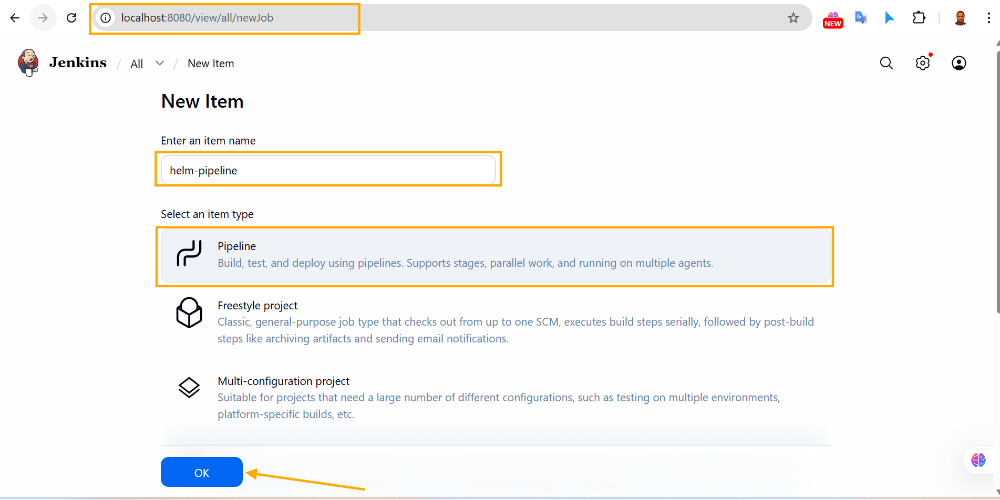

Step 2: Configure the Pipeline from Git
  - Scroll down to the **Pipeline** section.
    - Pipeline settings:
    - 👉 Pipeline script from SCM

- **SCM:**
    👉 Git

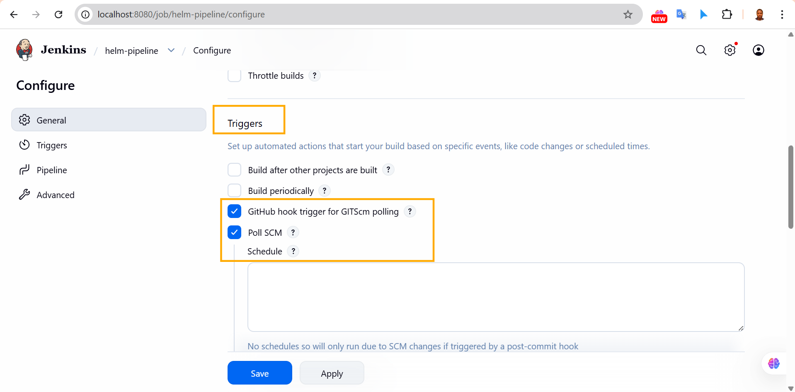

4. Pipeline Script Example with Full Helm Path:

    - Use the determined full path of Helm in the Pipeline script. For example:

```
        pipeline {"\n       agent any\n       stages {\n         stage('Deploy with Helm') {\n           steps {\n             script {\n               sh '/usr/local/bin/helm upgrade --install my-webapp ./webapp --namespace default'\n             "}
      }
    }
  }
}
```

- Bellow is a properly formatted script


```
pipeline {
    agent any

    options {
        skipDefaultCheckout(true)
    }

    environment {
        KUBECONFIG = '/var/lib/jenkins/.kube/config'
        HELM = '/usr/local/bin/helm'
    }

    stages {
        stage('Checkout Code') {
            steps {
                git branch: 'main', url: 'https://github.com/sammyCHY/helm-web-app1.git'
            }
        }

        stage('Deploy with Helm') {
            steps {
                sh '''
                    kubectl get nodes
                    helm upgrade --install my-webapp ./webapp --namespace default
                '''
            }
        }
    }
}
```

- Replace `/usr/local/bin/helm` with the path determined in Step 2.

The Image shows the Helm Pipeline Configured

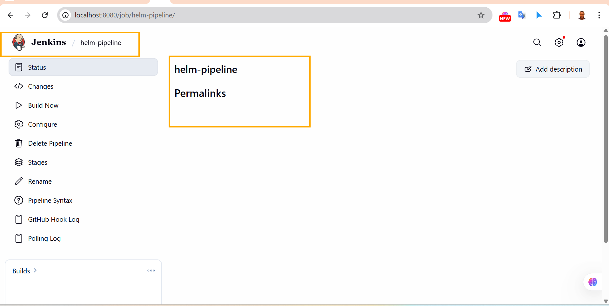


Make sure the Jenkins url is integrated with the github-webhook.

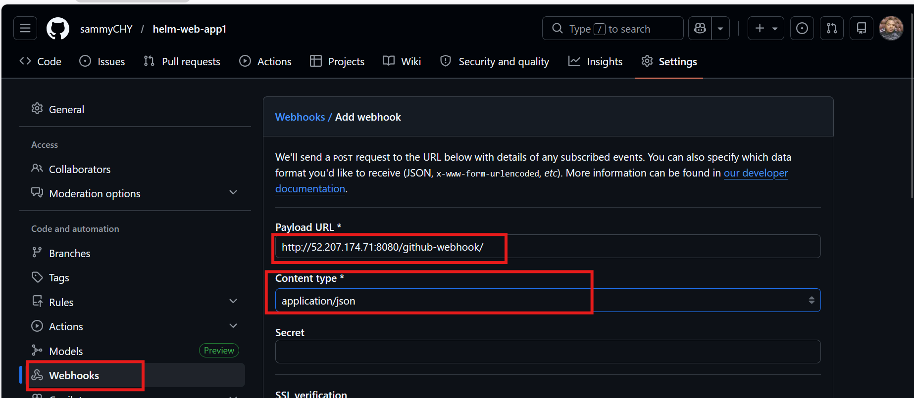


## Step 2: Update Helm Chart and Trigger Jenkins Pipeline.

1. Update Helm Chart and Push Changes:

    - Edit the `value.yaml` in your `webapp` chart directory.

    - Changes the `relicaCount` to `3` to increase the number of replicas.

    - Save the changes.

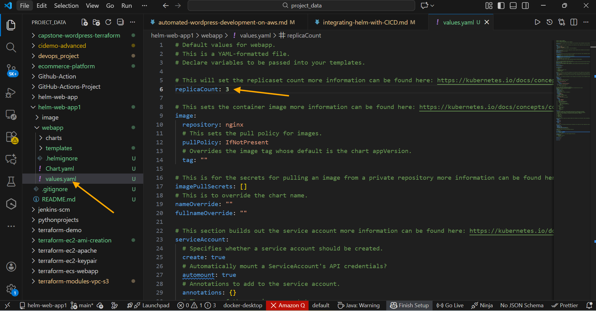


- Edit the  `templates/deployment.yaml` File:

    - Open `deployment.yaml` located in the `templates` directory.

    - Located the `resources` section under `spec.template.spec.containers`

    - Update the resource requested as follows:


```
resources:
  requests:
    memory: "180Mi"
    cpu: "120m"
```

  - Save the file after making your changes.

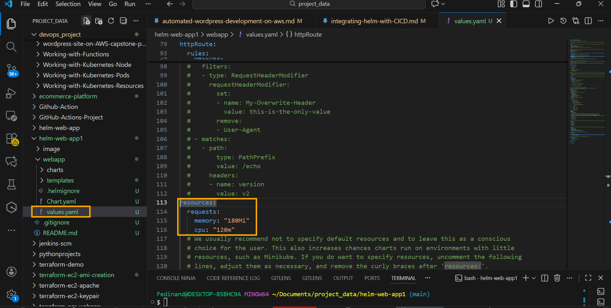

Bellow are the procedures to follow

First You have to create `helm-web-app1` directory then `cd` into the helm-web-app1

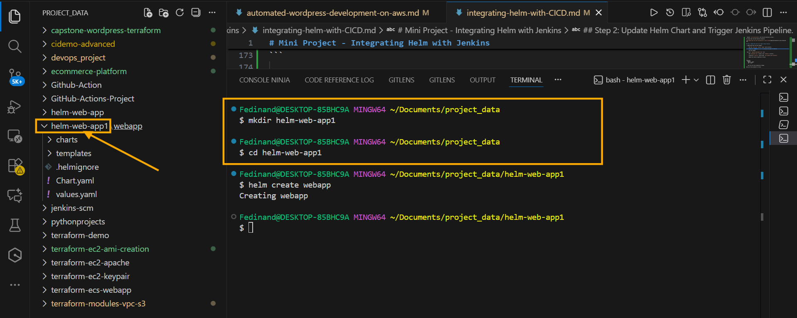

After creating `helm-web-app1` & `cd`  into the directory, then run this command bellow to create `webapp`.
`helm create webapp`
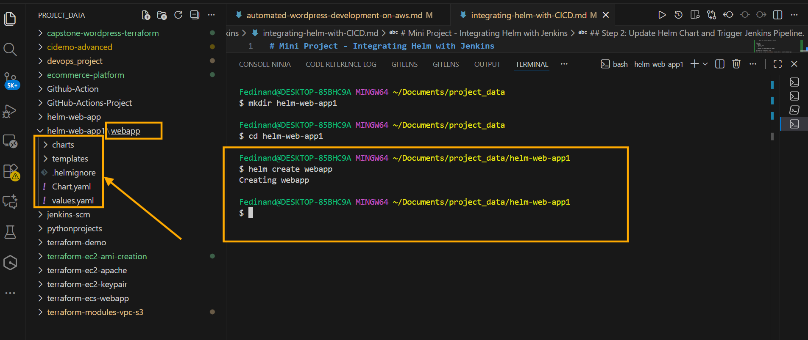


2. Commit and Push the Changes:

    - Use Git commands to commit these changes and push them to your remote repository. This will trigger the Jenkins Pipeline.

   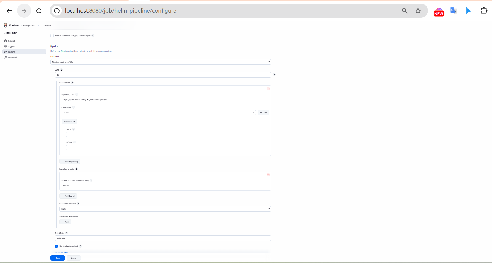

    - Execute the following commands in your terminal:

    ```
    git add .
    git commit -m "Updated replicas, memory and CPU requests"
    git push
    ```

3. Jenkins Pipeline Trigger:

    - Once you push the changes to the repository, the configured Jenkins Pipeline will detect the commit.

    - Jenkins will then automatically start a new build, deploying your updated Helm chart with the new configurations.  


### Jenkins Job Configuration (CRITICAL)

 A. Open Jenkins Job

 - Jenkins Dashboard
 - Click Your Pipeline job
 - Click Configure

B. Pipeline Section 

Set Exactly this:


Settings                        Value

Definition                      Pipeline script from SCM
SCM                             Git
Repository URL                  `https://github.com/sammyCHY/helm-web-app1.git`
Credentials                      (Set if Private repo)
Branches to build                `*/main`
Script Path                       Jenkinsfile

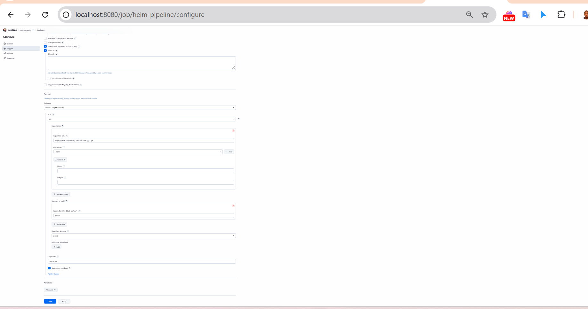

final decision result

Below is the Image of the final result, build successfully.

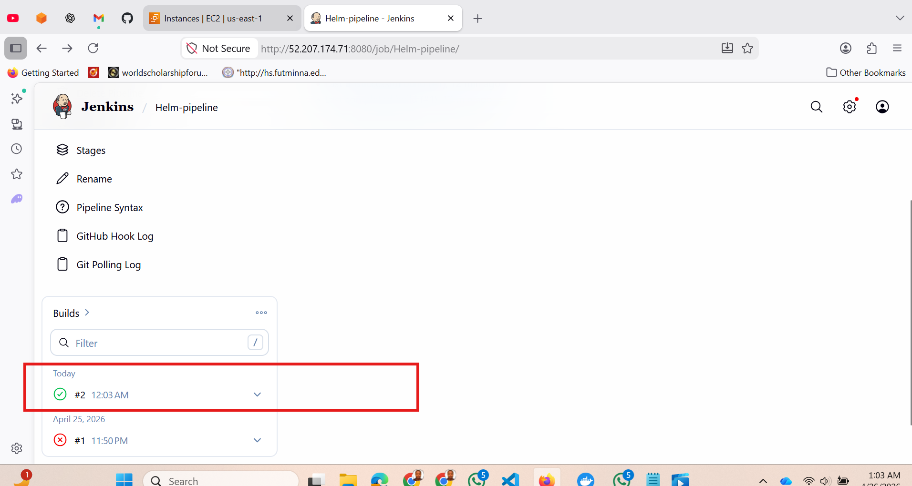


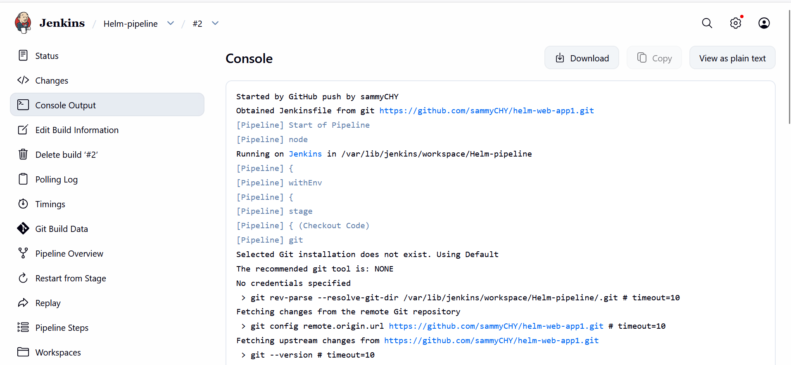


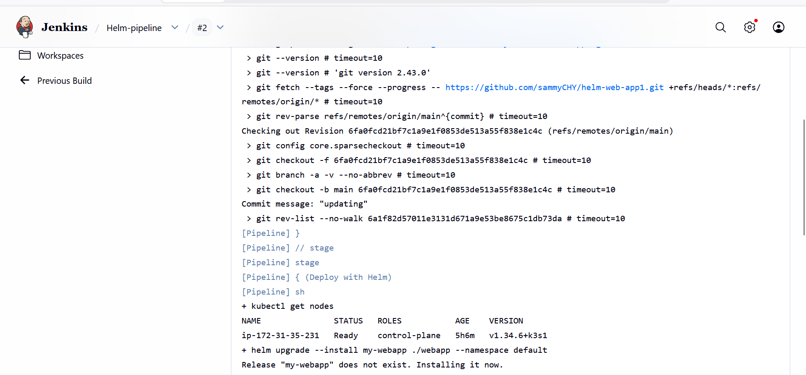

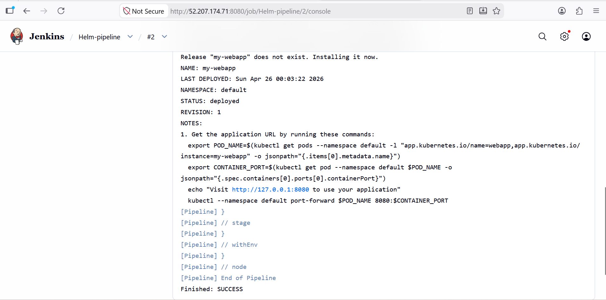


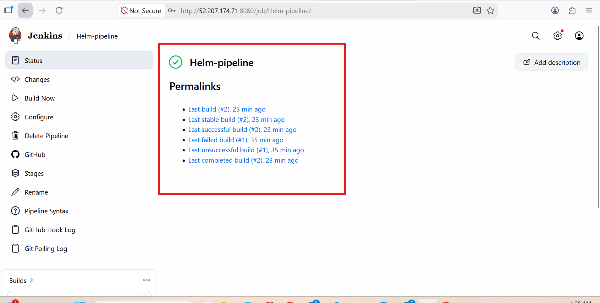